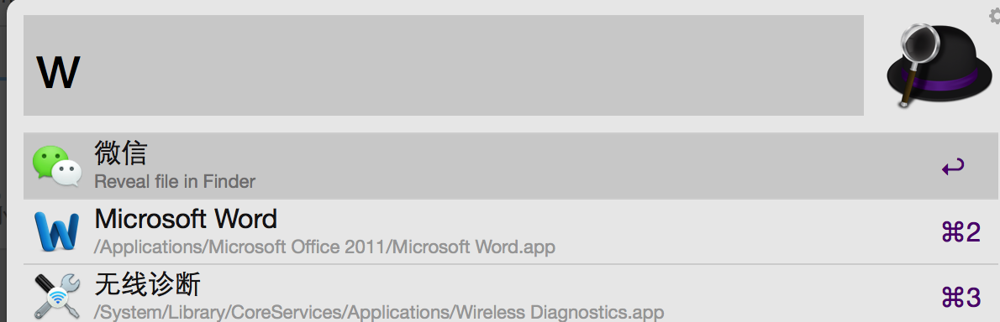
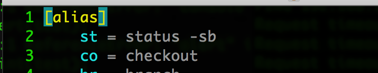

自从有了一台mac，觉得生活和工作中的很多小环节就发生了变化。 
虽然是工作本，但基本上就是全天随身。 
跟很多人用手机的心态一样。之前一直都是用windows，总是觉得这种东西是用来工作的，够用就行了。 
可一旦用上了，就不这么想了。 
由于之前一直都是这种保守的思想，所以对mac的认知接近于零。 
清晰记得刚拿到这个本的时候，问了同事一个很高深的问题：mac下怎么制作表格？ 
是的，我就是问了这个问题。同事心态很好，心平气和的说：你打开Numbers。 
可我找了半天，不知道哪个是Numbers，无奈又求助同事，同事过来给我点开了dock上的那个几根柱子的图标。
 相信用惯了mac的小伙伴已笑尿于厕，亏你还自诩程序猿。
 
<b>黔之虎没见过驴，一开始见到驴就被惊呆了，庞然不知何物。当时差不多就是这种状态。 </b>
 
 可是也恰恰是跟同事问了这个问题，从同事那里取到了真经。
 同事是个老牌mac用户，把近10年的使用习惯和收集到的小软件压入了他的timemashine。
 近50个G，惊讶的程度丝毫不比听到前几年流行的“我丢了个U盘，8个G的”这种话差多少。
 当天就沉浸在这50个G里。
 用mac也一段时间了，决定要把这段感受记下来。
 首先，mac不像windows，没有磁盘分区，所以对文件管理没有比较规律的习惯的小伙伴一开始肯定会比较苦恼的。
 没关系，mac有个很强大的搜索工具能弥补这个缺，那就是Spotlight，快捷键ctrl+space就能出来,也可以点击屏幕右上角的放大镜图标。
 Spotlight长这样：

 精巧实用，有了这东西，这就不用像windows那样一层一层的文件去翻。
 当然，windows下也有个很强力的文件搜索工具—everything.功能是一样的。
 这是不是就代表mac比windows弱呢，不是的。mac下还有一个比Spotlight更强大的文件搜索工具：<b>Toggle Alfred。</b>
 它是利用Spotlight做索引的，所以找文件会更快，更准。另外还能把你输入的关键词进行google搜索。 快捷键：alt+space（可自己设置）。
 Toggle Alfred长这样：

 是不是很棒？谁用谁知道。
 mac下的文件管理器就是默认情况下dock最左边的那个方形笑脸，Finder。它其实有点像手机上的文件管理工具，是把磁盘上的文件都归类管理的，比如文本文件、图片、音乐、视频。。。
 这相信一看就明白。
 什么？不知道dock是指什么？
 dock就是像windows上的任务栏一样的，屏幕最下方放着的一排图标那一块就叫dock。
 别跟我问windows上的任务栏是指什么。我可以原谅自己问哪个是Numbers，但真的难以原谅这个蠢问题。 同样级别的错误，或者说同一个错误，自己犯和别人犯能被自己原谅的可能性差很远的。
 默认情况下，dock上的左二图标就是应用管理工具，Launchpad，所有你已经安装了的应用程序都会在这里头有显示。
 也许有人会找不到像windows下的任务管理器的东西，是不是mac下没有？
 别闹了，这么要命的东西，mac下怎么会没有呢？
 mac虽很流畅，但也会卡，而且会很常见，那我要中途关掉那个卡的程序怎么办？
 mac下有个叫activity的工具，直接用Spotlight搜“act”关键字就出来了。
 这个工具就是任务管理器，怎么使用就自己摸索吧。
 mac下也有WPS，对应的就是Pages,Numbers,Keynote。这个就无需多讲。
 下面还介绍一款很使用的小工具：timeout
 经常对着电脑的小伙伴必备良品，它是定时骚扰器，可以每隔15分钟（默认）遮蔽屏幕15秒，过2个小时就遮蔽屏幕10分钟。就是强行让你休息一下，眼睛不要长时间对着电脑。当然你也可以马上关闭它。
好吧，下面介绍一些程序猿专用的东西。
 众所周知，mac是个linux。
 相信大部分程序猿都对linux情有独钟，如果你既想好用，又想装X，那不妨来个mac。这应该也是mac的一个抢不走的市场吧。
 brew是个在max的Terminal上玩的工具，很多软件你只要brew install就可以安装完成。
 知乎上经常会有这样一类问题：女生需要的基本款包包有哪些？男生需要的基本款女朋友有哪些？
 那mac下程序猿需要的基本款编辑器有哪些？ 
 大概应该如下：

* vi,vim： 无需多说
* xcode：专门的OS X、iOS应用开发工具；
* Subline: 估计大家都知道，很炫酷的编辑器，适合写网页代码，比如html,css,js...；
* Atom：也是一款基于web的开发工具。
* Beyond Compare：文本比较工具，非常好用。可以比较两个文本、文件夹、同步的、合并的…。
* Mou：markdown的编辑工具。

。。。 
 好吧，先介绍这么多。
 其实，还有很多小的提高工作效率的习惯（我也是从同事那学来的，^.^）。
 比如可以在dock的动态区做个workon的文件夹，把临时或近期要处理的文件都放到这里；
 再比如在用户根目录下配置一些命令的快捷键，具体的软件需要在具体的.config文件里配置（Terminal里玩的程序初始化时默认都会读取用户目录下的配置文件，一般是.开头，.config之类的，自己的全局变量就定义在.bash_profile文件里），比如使用git，我就想要用git co代替git checkout,那我只要在用户根目录下的.gitconfig文件里起别名就行了。
 直接 vi .gitconfig然后改动如下：

 alias是别名的意思。
 开启多个Terminal的快捷键是<b>cmd+n</b>。
 好吧，先写这些，感觉是些基础到不能再基础的东西，但是如果你是刚玩mac，说不定能用上。也是写在这里，给小白补补课，免得像我一样问别人Numbers在哪里。
 那Numbers在哪里呢？
 你过来，我保证不打你。 
 
<pre><code>
<b>follow me :</b>
Step one: ctrl+space，或者点击屏幕右上角的放大镜图标，打开Spotlight；
Step two: 在Spotlight里输入Numbers，回车。
</code></pre>
#####另外说几个mac的突出优势：
<pre><code>
1. 形色绝佳，轻薄、纯色，高端优雅能装B
2. 开机快，毕竟SSD，你会开始嫌弃windows；
3. 续航持久，10个小时，比手机还长，坚挺；
4. 视网膜屏，看上极舒服。
</code></pre>
真的 
无法 
抗拒。 
回到开头，说说我使用mac的感受： 
#####游戏不玩了，空间微博不刷了，经常记录点东西（印象笔记，你值得一用）。感觉脑壳不够用。
